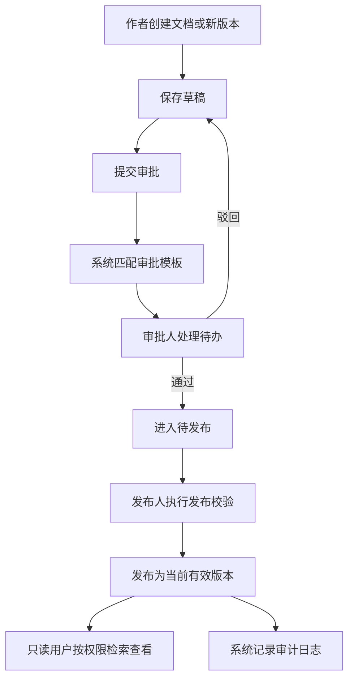

# 文档版本审批系统 PRD

## 1. 产品概述
文档版本审批系统面向企业内部文控、研发、质量、法务、运营等团队，用于统一管理文档基础信息、版本迭代、审批流程、发布状态和访问权限。
- 解决文档版本混乱、审批链路不可追溯、发布不受控、跨部门权限边界不清晰的问题。
- 提升文档流转效率、合规审计能力和已发布资料的可信度。

## 2. 核心功能

### 2.1 用户角色
| 角色 | 获取方式 | 核心权限 |
|------|----------|----------|
| 系统管理员 | 后台创建 | 管理用户、角色、部门、权限策略、全局字典 |
| 文档管理员 | 管理员授权 | 创建文档、维护基础信息、配置审批模板、执行发布和归档 |
| 作者 | 管理员或文档管理员授权 | 新建版本、编辑草稿、提交审批、查看本人相关流程 |
| 审批人 | 审批模板指定 | 查看待审版本、审批通过、驳回、加签、填写意见 |
| 发布人 | 管理员或流程指定 | 对已通过版本执行发布、撤回发布、废止 |
| 只读用户 | 部门授权或角色授权 | 按权限范围检索和查看已发布文档 |
| 审计员 | 管理员授权 | 查看流程记录、版本差异、发布记录、权限变更记录 |

### 2.2 功能模块
1. **登录与工作台**：账号登录、角色识别、待办审批、我的草稿、最近发布、统计卡片。
2. **文档库**：文档基础信息、分类目录、标签、负责人、保密级别、适用部门、生命周期状态。
3. **版本管理**：版本号规则、草稿版本、审批中版本、已发布版本、版本比较、版本回滚申请。
4. **审批流程**：流程模板、节点审批、会签/或签、驳回重提、审批意见、流程轨迹。
5. **发布管控**：发布前校验、发布窗口、当前有效版本、撤回发布、废止、归档。
6. **权限隔离**：角色权限、部门权限、文档级 ACL、保密级别过滤、操作按钮级控制。
7. **多条件检索**：关键词、编号、标题、分类、标签、状态、版本、作者、部门、时间范围、发布状态组合查询。
8. **审计日志**：登录、创建、编辑、提交、审批、发布、撤回、权限变更全链路留痕。

### 2.3 页面详情
| 页面名称 | 模块名称 | 功能描述 |
|----------|----------|----------|
| 登录页 | 身份认证 | 用户名密码登录，失败提示，登录后基于角色进入工作台 |
| 工作台 | 待办与概览 | 展示待审批、待发布、我的草稿、最近发布和流程统计 |
| 文档库 | 列表与检索 | 支持多条件检索、分页、排序、筛选、导出检索结果 |
| 文档详情 | 基础信息 | 查看编号、标题、分类、状态、密级、负责人、适用范围、附件摘要 |
| 文档详情 | 版本列表 | 展示所有版本、版本状态、创建人、审批状态、发布时间和当前有效标记 |
| 版本编辑页 | 草稿维护 | 编辑版本说明、变更摘要、正文内容、附件元数据，提交审批 |
| 审批中心 | 待办审批 | 审批人查看待办，支持通过、驳回、加签、填写意见 |
| 流程配置页 | 审批模板 | 配置文档分类对应审批模板、节点顺序、审批角色和通过规则 |
| 发布管理页 | 发布管控 | 查看待发布版本，执行发布、撤回、废止、归档和发布记录查询 |
| 权限管理页 | 权限隔离 | 配置角色、部门、文档 ACL、密级访问策略 |
| 审计日志页 | 操作追踪 | 查询关键操作日志、审批轨迹、发布记录、权限变更 |

## 3. 核心流程
作者创建或更新文档版本后提交审批，系统按文档分类和密级匹配审批模板。审批通过后版本进入待发布状态，发布人进行发布校验并将该版本设为当前有效版本。用户检索文档时，系统根据角色、部门、密级和文档 ACL 返回可见范围内的结果。

## 4. 用户界面设计

### 4.1 设计风格
- 主色：深海蓝 `#102A43`，强调色：琥珀金 `#F59E0B`，成功色：松石绿 `#0F766E`，危险色：朱红 `#DC2626`。
- 风格定位：企业级、克制、审计友好，强调可信、清晰和高信息密度。
- 按钮：圆角 10px，主按钮使用深色实底，危险操作使用描边加二次确认。
- 字体：标题使用较有辨识度的衬线或类报刊标题风格，正文使用清晰的人文无衬线字体。
- 布局：桌面优先，左侧主导航，顶部全局搜索，内容区采用卡片、表格和流程时间线组合。
- 图标：线性图标为主，审批状态使用色块和标签组合，避免仅靠颜色传达状态。

### 4.2 页面设计概览
| 页面名称 | 模块名称 | UI 元素 |
|----------|----------|---------|
| 工作台 | 指标概览 | 深色标题区、统计卡片、待办列表、状态徽标、流程趋势图 |
| 文档库 | 检索表格 | 条件折叠面板、固定表头、状态标签、密级标识、快捷操作 |
| 文档详情 | 信息总览 | 左侧基础信息，右侧版本时间线，顶部当前有效版本提示 |
| 版本编辑页 | 内容编辑 | 分区表单、变更摘要、附件清单、保存草稿和提交审批按钮 |
| 审批中心 | 流程处理 | 待办分组、审批意见输入、流程轨迹、风险提示 |
| 发布管理页 | 发布控制 | 待发布队列、发布前检查项、发布确认弹窗、发布历史 |
| 权限管理页 | 权限策略 | 角色矩阵、部门树、文档 ACL 表格、密级策略提示 |

### 4.3 响应式设计
桌面优先，适配 1440px、1280px 和 1024px 宽度；移动端保留查询、查看和审批处理能力，复杂配置页提示使用桌面端操作。表格在窄屏下切换为摘要卡片，关键操作保持触控友好。
