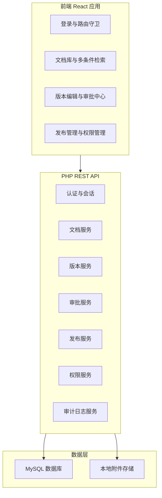
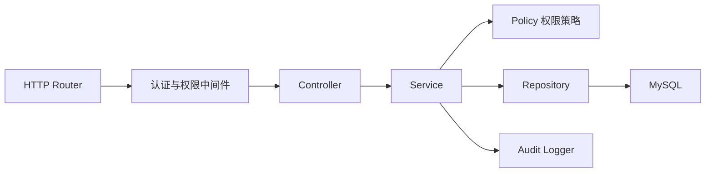
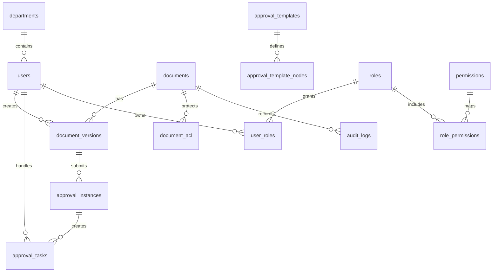

# 文档版本审批系统技术架构

## 1. 架构设计



采用前后端分离架构。React 负责企业级管理界面、权限感知路由和交互状态；PHP 提供 REST API、业务状态机、权限过滤和审计记录；MySQL 保存核心业务数据；附件默认落地到后端本地目录，后续可替换为对象存储。

## 2. 技术说明
- 前端：React@18 + Vite + TypeScript + Tailwind CSS + React Router + TanStack Query。
- 后端：PHP@8.2 + Slim Framework@4 + PDO + Composer。
- 数据库：MySQL@8，使用 InnoDB、外键、事务和必要组合索引。
- 认证：JWT Bearer Token，密码使用 `password_hash` 和 `password_verify`。
- 权限：RBAC + 部门范围 + 文档 ACL + 密级校验，所有查询和操作在后端二次校验。
- 审批：基于审批模板和流程实例的状态机，关键操作使用事务保证一致性。
- 文件：本地 `storage/uploads`，数据库保存文件元数据、哈希、大小和版本关联。

## 3. 路由定义
| 路由 | 用途 |
|------|------|
| `/login` | 登录页 |
| `/app/dashboard` | 工作台 |
| `/app/documents` | 文档库与多条件检索 |
| `/app/documents/new` | 新建文档 |
| `/app/documents/:id` | 文档详情、基础信息、版本列表 |
| `/app/documents/:id/versions/:versionId/edit` | 编辑草稿版本 |
| `/app/approvals` | 审批中心 |
| `/app/releases` | 发布管理 |
| `/app/permissions` | 权限管理 |
| `/app/audit-logs` | 审计日志 |

## 4. API 定义

### 4.1 认证
```ts
type LoginRequest = {
  username: string;
  password: string;
};

type LoginResponse = {
  token: string;
  user: UserProfile;
  permissions: string[];
};
```

| 方法 | 路径 | 说明 |
|------|------|------|
| `POST` | `/api/auth/login` | 登录并返回 Token |
| `GET` | `/api/auth/me` | 获取当前用户、角色和权限 |

### 4.2 文档与检索
```ts
type DocumentSearchQuery = {
  keyword?: string;
  code?: string;
  title?: string;
  categoryId?: number;
  tag?: string;
  status?: "draft" | "active" | "archived" | "voided";
  versionStatus?: "draft" | "in_review" | "approved" | "published" | "rejected";
  ownerId?: number;
  departmentId?: number;
  confidentialityLevel?: "public" | "internal" | "confidential" | "secret";
  publishedFrom?: string;
  publishedTo?: string;
  page?: number;
  pageSize?: number;
};
```

| 方法 | 路径 | 说明 |
|------|------|------|
| `GET` | `/api/documents` | 多条件检索文档，按权限过滤结果 |
| `POST` | `/api/documents` | 创建文档基础信息和首个草稿版本 |
| `GET` | `/api/documents/{id}` | 查看文档详情 |
| `PUT` | `/api/documents/{id}` | 更新文档基础信息 |
| `GET` | `/api/documents/{id}/versions` | 查看文档版本列表 |
| `POST` | `/api/documents/{id}/versions` | 创建新草稿版本 |
| `PUT` | `/api/versions/{versionId}` | 更新草稿版本 |

### 4.3 审批与发布
| 方法 | 路径 | 说明 |
|------|------|------|
| `POST` | `/api/versions/{versionId}/submit` | 提交审批 |
| `GET` | `/api/approvals/tasks` | 获取当前用户待办 |
| `POST` | `/api/approvals/tasks/{taskId}/approve` | 审批通过 |
| `POST` | `/api/approvals/tasks/{taskId}/reject` | 审批驳回 |
| `POST` | `/api/approvals/tasks/{taskId}/add-assignee` | 加签 |
| `GET` | `/api/approvals/instances/{instanceId}` | 查看流程轨迹 |
| `GET` | `/api/releases/pending` | 待发布版本列表 |
| `POST` | `/api/versions/{versionId}/publish` | 发布版本为当前有效版本 |
| `POST` | `/api/versions/{versionId}/withdraw` | 撤回发布 |
| `POST` | `/api/versions/{versionId}/void` | 废止版本 |

### 4.4 权限与审计
| 方法 | 路径 | 说明 |
|------|------|------|
| `GET` | `/api/roles` | 角色列表 |
| `POST` | `/api/roles` | 创建角色 |
| `PUT` | `/api/roles/{id}/permissions` | 配置角色权限 |
| `PUT` | `/api/documents/{id}/acl` | 配置文档级 ACL |
| `GET` | `/api/audit-logs` | 查询审计日志 |

## 5. 服务端架构图



核心约束：
- Controller 只处理请求解析和响应格式。
- Service 承载状态机、事务和业务校验。
- Policy 集中处理角色、部门、ACL、密级和按钮级权限判断。
- Repository 只负责 SQL 和数据映射。
- Audit Logger 在事务成功后记录关键业务事件。

## 6. 数据模型

### 6.1 数据模型定义



### 6.2 数据定义语言

```sql
CREATE TABLE departments (
  id BIGINT UNSIGNED PRIMARY KEY AUTO_INCREMENT,
  name VARCHAR(100) NOT NULL,
  parent_id BIGINT UNSIGNED NULL,
  created_at DATETIME NOT NULL DEFAULT CURRENT_TIMESTAMP,
  INDEX idx_departments_parent (parent_id)
);

CREATE TABLE users (
  id BIGINT UNSIGNED PRIMARY KEY AUTO_INCREMENT,
  department_id BIGINT UNSIGNED NULL,
  username VARCHAR(80) NOT NULL UNIQUE,
  password_hash VARCHAR(255) NOT NULL,
  display_name VARCHAR(100) NOT NULL,
  email VARCHAR(160) NULL,
  status ENUM('active', 'disabled') NOT NULL DEFAULT 'active',
  created_at DATETIME NOT NULL DEFAULT CURRENT_TIMESTAMP,
  FOREIGN KEY (department_id) REFERENCES departments(id)
);

CREATE TABLE roles (
  id BIGINT UNSIGNED PRIMARY KEY AUTO_INCREMENT,
  code VARCHAR(80) NOT NULL UNIQUE,
  name VARCHAR(100) NOT NULL
);

CREATE TABLE permissions (
  id BIGINT UNSIGNED PRIMARY KEY AUTO_INCREMENT,
  code VARCHAR(120) NOT NULL UNIQUE,
  name VARCHAR(120) NOT NULL
);

CREATE TABLE user_roles (
  user_id BIGINT UNSIGNED NOT NULL,
  role_id BIGINT UNSIGNED NOT NULL,
  PRIMARY KEY (user_id, role_id),
  FOREIGN KEY (user_id) REFERENCES users(id),
  FOREIGN KEY (role_id) REFERENCES roles(id)
);

CREATE TABLE role_permissions (
  role_id BIGINT UNSIGNED NOT NULL,
  permission_id BIGINT UNSIGNED NOT NULL,
  PRIMARY KEY (role_id, permission_id),
  FOREIGN KEY (role_id) REFERENCES roles(id),
  FOREIGN KEY (permission_id) REFERENCES permissions(id)
);

CREATE TABLE document_categories (
  id BIGINT UNSIGNED PRIMARY KEY AUTO_INCREMENT,
  name VARCHAR(120) NOT NULL,
  parent_id BIGINT UNSIGNED NULL,
  approval_template_id BIGINT UNSIGNED NULL,
  INDEX idx_categories_parent (parent_id)
);

CREATE TABLE documents (
  id BIGINT UNSIGNED PRIMARY KEY AUTO_INCREMENT,
  code VARCHAR(80) NOT NULL UNIQUE,
  title VARCHAR(200) NOT NULL,
  category_id BIGINT UNSIGNED NOT NULL,
  owner_id BIGINT UNSIGNED NOT NULL,
  department_id BIGINT UNSIGNED NULL,
  confidentiality_level ENUM('public', 'internal', 'confidential', 'secret') NOT NULL DEFAULT 'internal',
  status ENUM('draft', 'active', 'archived', 'voided') NOT NULL DEFAULT 'draft',
  current_version_id BIGINT UNSIGNED NULL,
  tags JSON NULL,
  summary TEXT NULL,
  created_at DATETIME NOT NULL DEFAULT CURRENT_TIMESTAMP,
  updated_at DATETIME NOT NULL DEFAULT CURRENT_TIMESTAMP ON UPDATE CURRENT_TIMESTAMP,
  FOREIGN KEY (category_id) REFERENCES document_categories(id),
  FOREIGN KEY (owner_id) REFERENCES users(id),
  FOREIGN KEY (department_id) REFERENCES departments(id),
  INDEX idx_documents_search (category_id, status, confidentiality_level),
  FULLTEXT INDEX ft_documents_title_summary (title, summary)
);

CREATE TABLE document_versions (
  id BIGINT UNSIGNED PRIMARY KEY AUTO_INCREMENT,
  document_id BIGINT UNSIGNED NOT NULL,
  version_no VARCHAR(40) NOT NULL,
  title VARCHAR(200) NOT NULL,
  change_summary TEXT NULL,
  content MEDIUMTEXT NULL,
  status ENUM('draft', 'in_review', 'approved', 'published', 'rejected', 'withdrawn', 'voided') NOT NULL DEFAULT 'draft',
  created_by BIGINT UNSIGNED NOT NULL,
  submitted_at DATETIME NULL,
  approved_at DATETIME NULL,
  published_at DATETIME NULL,
  created_at DATETIME NOT NULL DEFAULT CURRENT_TIMESTAMP,
  updated_at DATETIME NOT NULL DEFAULT CURRENT_TIMESTAMP ON UPDATE CURRENT_TIMESTAMP,
  UNIQUE KEY uk_document_version (document_id, version_no),
  FOREIGN KEY (document_id) REFERENCES documents(id),
  FOREIGN KEY (created_by) REFERENCES users(id),
  INDEX idx_versions_status (status, published_at)
);

CREATE TABLE approval_templates (
  id BIGINT UNSIGNED PRIMARY KEY AUTO_INCREMENT,
  name VARCHAR(120) NOT NULL,
  status ENUM('active', 'disabled') NOT NULL DEFAULT 'active',
  created_at DATETIME NOT NULL DEFAULT CURRENT_TIMESTAMP
);

CREATE TABLE approval_template_nodes (
  id BIGINT UNSIGNED PRIMARY KEY AUTO_INCREMENT,
  template_id BIGINT UNSIGNED NOT NULL,
  node_order INT NOT NULL,
  node_name VARCHAR(120) NOT NULL,
  approval_type ENUM('all', 'any') NOT NULL DEFAULT 'all',
  role_id BIGINT UNSIGNED NULL,
  user_id BIGINT UNSIGNED NULL,
  FOREIGN KEY (template_id) REFERENCES approval_templates(id),
  FOREIGN KEY (role_id) REFERENCES roles(id),
  FOREIGN KEY (user_id) REFERENCES users(id)
);

CREATE TABLE approval_instances (
  id BIGINT UNSIGNED PRIMARY KEY AUTO_INCREMENT,
  version_id BIGINT UNSIGNED NOT NULL,
  template_id BIGINT UNSIGNED NOT NULL,
  status ENUM('running', 'approved', 'rejected', 'cancelled') NOT NULL DEFAULT 'running',
  current_node_order INT NOT NULL DEFAULT 1,
  created_at DATETIME NOT NULL DEFAULT CURRENT_TIMESTAMP,
  completed_at DATETIME NULL,
  FOREIGN KEY (version_id) REFERENCES document_versions(id),
  FOREIGN KEY (template_id) REFERENCES approval_templates(id)
);

CREATE TABLE approval_tasks (
  id BIGINT UNSIGNED PRIMARY KEY AUTO_INCREMENT,
  instance_id BIGINT UNSIGNED NOT NULL,
  node_name VARCHAR(120) NOT NULL,
  assignee_id BIGINT UNSIGNED NOT NULL,
  status ENUM('pending', 'approved', 'rejected', 'skipped') NOT NULL DEFAULT 'pending',
  opinion TEXT NULL,
  created_at DATETIME NOT NULL DEFAULT CURRENT_TIMESTAMP,
  handled_at DATETIME NULL,
  FOREIGN KEY (instance_id) REFERENCES approval_instances(id),
  FOREIGN KEY (assignee_id) REFERENCES users(id),
  INDEX idx_tasks_assignee_status (assignee_id, status)
);

CREATE TABLE document_acl (
  id BIGINT UNSIGNED PRIMARY KEY AUTO_INCREMENT,
  document_id BIGINT UNSIGNED NOT NULL,
  subject_type ENUM('user', 'role', 'department') NOT NULL,
  subject_id BIGINT UNSIGNED NOT NULL,
  access_level ENUM('read', 'edit', 'approve', 'publish', 'admin') NOT NULL,
  FOREIGN KEY (document_id) REFERENCES documents(id),
  INDEX idx_acl_document_subject (document_id, subject_type, subject_id)
);

CREATE TABLE audit_logs (
  id BIGINT UNSIGNED PRIMARY KEY AUTO_INCREMENT,
  actor_id BIGINT UNSIGNED NULL,
  entity_type VARCHAR(80) NOT NULL,
  entity_id BIGINT UNSIGNED NOT NULL,
  action VARCHAR(80) NOT NULL,
  before_data JSON NULL,
  after_data JSON NULL,
  ip_address VARCHAR(64) NULL,
  created_at DATETIME NOT NULL DEFAULT CURRENT_TIMESTAMP,
  FOREIGN KEY (actor_id) REFERENCES users(id),
  INDEX idx_audit_entity (entity_type, entity_id),
  INDEX idx_audit_action_time (action, created_at)
);
```

## 7. 状态机规则
- 文档状态：`draft -> active -> archived`，任意非归档文档可被管理员废止为 `voided`。
- 版本状态：`draft -> in_review -> approved -> published`；审批驳回进入 `rejected`，重新编辑后可再次提交；已发布版本可撤回为 `withdrawn` 或废止为 `voided`。
- 同一文档任意时刻只允许一个 `current_version_id`，发布新版本时必须在事务中更新旧版本和文档当前版本。
- 审批任务必须校验当前处理人、任务状态、流程实例状态和版本状态。
- 发布操作必须校验版本已审批通过、操作者具备发布权限、文档未归档或废止。

## 8. 权限策略
- 前端根据 `/api/auth/me` 返回的权限隐藏不可用入口，但不作为安全边界。
- 后端每个 API 使用权限中间件和业务 Policy 双重校验。
- 文档检索 SQL 必须追加可见性条件：角色权限、部门范围、文档 ACL、密级等级。
- 文档编辑、审批、发布、权限配置都必须写入审计日志。
